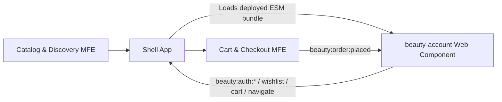

# LUMÉA Beauty — Account & Orders Microfrontend

[](https://vuejs.org/)
[](https://vuetifyjs.com/)
[](https://vite.dev/)

The **Account & Orders** experience for LUMÉA Beauty, a cosmetics e-commerce store. This project is independently deployable and exposes its UI as a **Web Component** for use inside the shared shell alongside the Catalog and Cart/Checkout microfrontends.

## Links

| Resource | Link |
| --- | --- |
| Standalone app (Live URL) | [microfrontend-e-commerce-account-or.vercel.app](https://microfrontend-e-commerce-account-or.vercel.app/) |
| Deployed Web Component bundle | [beauty-account.js](https://microfrontend-e-commerce-account-or.vercel.app/mfe/beauty-account.js) |
| Repository | [Microfrontend-E-commerce-Account-orders](https://github.com/Mohamad-husain/Microfrontend-E-commerce-Account-orders) |
| Architecture diagram | [docs/architecture.md](docs/architecture.md) |

> The Shell, Catalog, and Cart/Checkout URLs should be added to the Shell repository once deployed. This repository owns the Account & Orders slice only.

## Responsibilities and features

This microfrontend owns the signed-in customer experience, including:

- Mock login and account registration.
- Viewing and updating personal profile information.
- Order history, order search/status filters, and **Buy again** / **Track order** actions.
- Wishlist management and moving products to the cart.
- Viewing, adding, editing, and deleting reviews.
- Local persistence through `localStorage`, seeded from JSON fixture data.

## Technology and design system

| Area | Choice |
| --- | --- |
| Framework | Vue 3 + TypeScript |
| UI / Material Design | Vuetify |
| State management | Pinia |
| Routing | Vue Router |
| Build tool | Vite |
| Deployment | Vercel |

The UI follows Material Design through Vuetify and the shared LUMÉA visual identity—color palette, spacing, typography, buttons, and cards—so it remains cohesive with the rest of the store when integrated.

## Run locally

**Requirements:** Node.js 22+ and npm. The configured ESLint toolchain uses `Object.groupBy`, which requires Node 22 or a runtime with that API.

```bash
npm install
npm run dev
```

The development server runs at `http://localhost:3000`.

### Project commands

| Command | Description |
| --- | --- |
| `npm run dev` | Run the standalone app locally. |
| `npm run lint` | Run ESLint checks. |
| `npm run type-check` | Type-check TypeScript and Vue files. |
| `npm run build` | Type-check and build the Web Component into `dist/mfe/`. |
| `npm run preview` | Preview the production build locally. |

## Exposed routes

| Standalone route | `route` value when embedded | Description | Authentication required |
| --- | --- | --- | --- |
| `/login` | `login` | Sign in | No |
| `/register` | `register` | Create an account | No |
| `/account/profile` | `profile` | Personal information | Yes |
| `/account/orders` | `orders` | Order history | Yes |
| `/account/wishlist` | `wishlist` | Wishlist | Yes |
| `/account/reviews` | `reviews` | Reviews | Yes |

Both `/` and `/account` redirect to the profile page. An unauthenticated visitor requesting a protected page is redirected to sign in.

## Shell integration

### Integration method

This microfrontend is integrated through **Web Components**. The `beauty-account.js` bundle defines `<beauty-account>` once, so the Shell has no dependency on Vue or a local copy of this project.

```html
<script
  type="module"
  src="https://microfrontend-e-commerce-account-or.vercel.app/mfe/beauty-account.js"
></script>

<beauty-account
  route="profile"
  routing="none"
  hide-chrome
></beauty-account>
```

### Element attributes

| Attribute | Values | Behavior |
| --- | --- | --- |
| `route` | `login`, `register`, `profile`, `orders`, `wishlist`, `reviews` | Selects the page to display. Updating it after loading navigates to the new page. |
| `routing` | `standalone` or `none` | `none` uses Vue Router's memory history when hosted in a Shell; any other value uses standalone routing. |
| `hide-chrome` | Boolean attribute | Hides the app header and footer to avoid duplicating Shell navigation. |

With `routing="none"`, the app emits a navigation event so the Shell can keep its public URL in sync.

## Event contract

Events are dispatched on `window` with `CustomEvent`. The Shell should subscribe after loading the bundle, then update the cart or routing based on each event.

### Events emitted by Account & Orders

| Event | When it is emitted | `detail` |
| --- | --- | --- |
| `beauty:auth:login` | A user signs in, registers, or updates their profile | `{ user }`; the user object never includes a password. |
| `beauty:auth:logout` | A user signs out | `{}` |
| `beauty:wishlist:updated` | The wishlist changes | `{ count }` |
| `beauty:cart:add` | A wishlist item is moved to cart or **Buy again** is selected | `{ productId, quantity, product }` or `{ order }` |
| `beauty:track-order` | A user selects order tracking | `{ orderId, order }` |
| `beauty:navigate` | The user returns to the store | `{ section: "home" }` |
| `beauty:navigate` | Internal navigation with `routing="none"` | `{ to: "/login" \| "/register" \| "/profile" \| "/orders" \| "/wishlist" \| "/reviews" }` |

Example: receive an add-to-cart event:

```js
window.addEventListener('beauty:cart:add', ({ detail }) => {
  // Forward the product or order items to the Cart & Checkout microfrontend.
  console.log(detail);
});
```

### Event received by Account & Orders

Cart & Checkout dispatches the following event after a successful order:

| Event | Expected `detail` | Result |
| --- | --- | --- |
| `beauty:order:placed` | `{ items, total, shippingInfo, paymentMethod }` | Creates a `Processing` order for the signed-in user and stores it in `localStorage`. |

```js
window.dispatchEvent(new CustomEvent('beauty:order:placed', {
  detail: {
    items: [{ id: 'product-1', qty: 1, price: 24 }],
    total: 24,
    shippingInfo: {
      fullName: 'Jane Doe', address: '1 Main St', city: 'Amman',
      state: 'Amman', postalCode: '11118'
    },
    paymentMethod: 'card'
  }
}));
```

## Data and current limitations

- There is no backend or database; authentication and payment are mocked.
- Seed data lives in `src/data/*.json` and is copied into `localStorage` on first use.
- Changes are stored in the current browser only; there is no cross-device or cross-user synchronization.
- User passwords are never included in authentication events.

To reset demo data, delete `lumea_*` keys from Local Storage in your browser's developer tools.

## Architecture



For the expanded diagram, see [architecture.md](docs/architecture.md).

## Integration notes

- **Chosen method:** Web Components, because they work across Vue, React, and Lit without sharing a framework or local component copies.
- **Why it was chosen:** The Shell loads one deployed version of this microfrontend, controls the active page with attributes, and communicates through standard DOM events.
- **Hardest part:** Coordinating routing and state across independent applications. The embedded mode uses `routing="none"` with memory history and emits `beauty:navigate` so the Shell can synchronize its external route.

## Project structure

```text
src/
├── components/     # Shared UI, account, orders, wishlist, and review components
├── data/           # Mock seed data
├── layouts/         # Account and authentication layouts
├── mfe/             # Web Component entry point
├── pages/           # Route pages
├── router/          # Routes and route guards
├── services/        # Local Storage and integration event contract
└── stores/          # Pinia stores
```

## Deployment

Running `npm run build` creates the integration bundle at:

```text
dist/mfe/beauty-account.js
```

The Vercel configuration rewrites routes to `index.html`, enabling direct standalone navigation to URLs such as `/account/orders`.

---

Part of the **Microfrontend E-commerce** project — LUMÉA Beauty.
