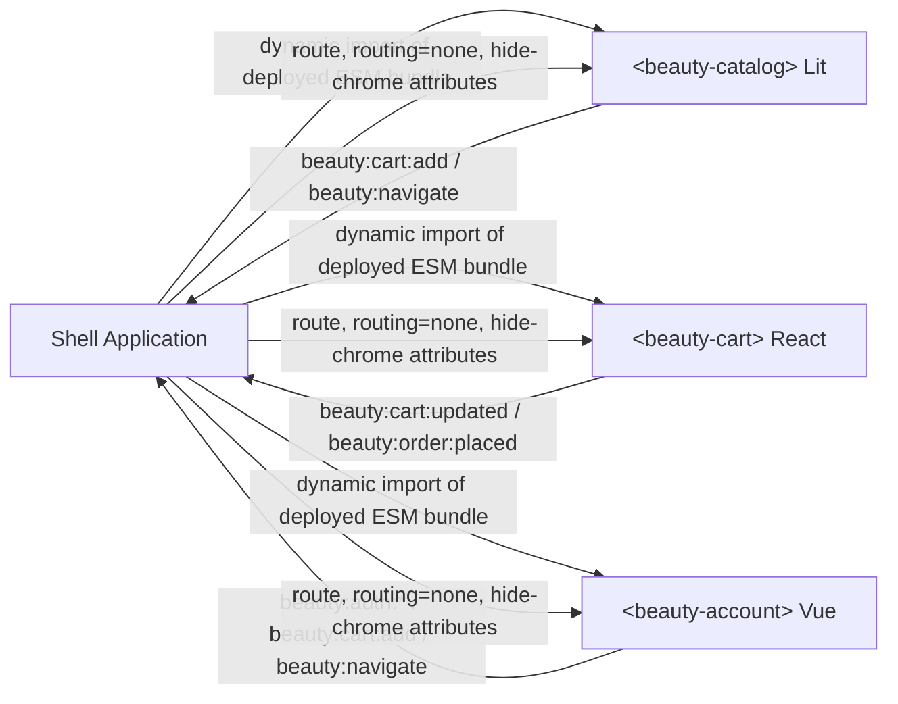

# Architecture

Account is independently deployable: its Vue UI, Pinia state, JSON seed data, and localStorage persistence live entirely in this project. Seed JSON is copied once, then Pinia stores update localStorage for runtime changes.

The shell composes live deployed bundles as Web Components. It does not import sibling source files or use iframes. The components communicate through namespaced `beauty:*` CustomEvents on `window`.

Current limitations: no backend, no cross-device sync, mock authentication, and mock payment methods. Catalog/cart remain separate microfrontends.
