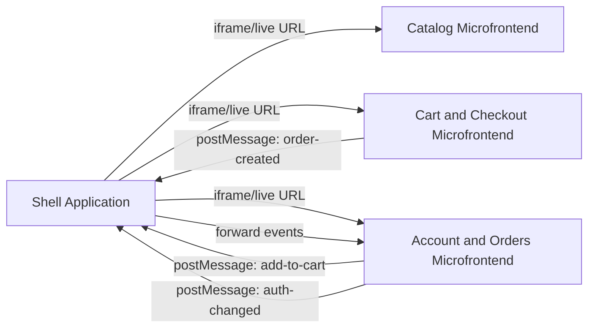

# Architecture

Account is independently deployable: its Vue UI, Pinia state, JSON seed data, and localStorage persistence live entirely in this project. Seed JSON is copied once, then Pinia stores update localStorage for runtime changes.

The shell may compose applications in iframes. Account emits CustomEvents for same-page hosting and postMessage payloads for iframe hosting. Production shells must set `VITE_SHELL_ORIGIN` and validate message origins before processing them.

Current limitations: no backend, no cross-device sync, mock authentication, and mock payment methods. Catalog/cart remain separate microfrontends.
